

<h1>Hey, I'm Ali</h1>
<h2>Welcome to my tech corner.</h2>

## About Me

I'm an AI undergrad and **Microsoft Student Ambassador** who likes building things that actually work.

I focus on **intelligent agentic and RAG systems**, backed by secure, reliable APIs built with **Python and FastAPI**.

I also enjoy helping other students explore tech and AI. This is where I share the projects I'm proud of and the ones that taught me the most.

## Featured Projects

### [Discord Documentation Copilot](https://github.com/alihassanwarsi/discord-documentation-copilot)

A RAG system for Discord documentation with hybrid retrieval, reranking, verified citations, semantic verification, confidence scoring, and safe refusal handling.

`Python` `LangChain` `Chroma` `Hugging Face` `BM25` `RRF` `Cohere` `BAAI Reranker` `Groq` `RAGAS` `FastAPI` `Uvicorn` `Streamlit` `Pytest`

### [Permissioned Agent Sandbox](https://github.com/alihassanwarsi/permissioned-agent-sandbox)

A tool-using AI agent with a permission and risk-control layer, where tool calls are allowed, confirmed, escalated, or denied based on roles and risk levels, with human approval and end-to-end tracing.

`Python` `LangGraph` `FastAPI` `Pydantic` `Groq` `Tavily` `OpenTelemetry` `HTML` `CSS` `JavaScript` `Pytest` `uv` `Docker`

### [FlyRank Social Studio](https://github.com/alihassanwarsi/flyrank-capstone-social-studio)

A backend capstone from my FlyRank AI internship that turns source content into platform-specific social posts using Gemini, supports human review and scheduling, and publishes through real and mock platform adapters.

`Python` `FastAPI` `Uvicorn` `PostgreSQL` `Psycopg` `Pydantic` `Gemini API` `httpx` `BeautifulSoup4` `Docker Compose` `Pytest`

## Tech Stack

### AI & Retrieval

  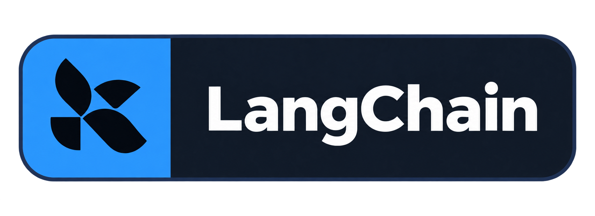
  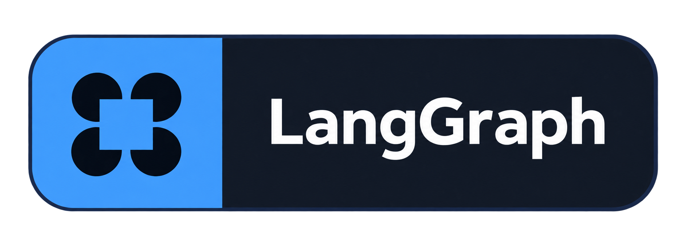
  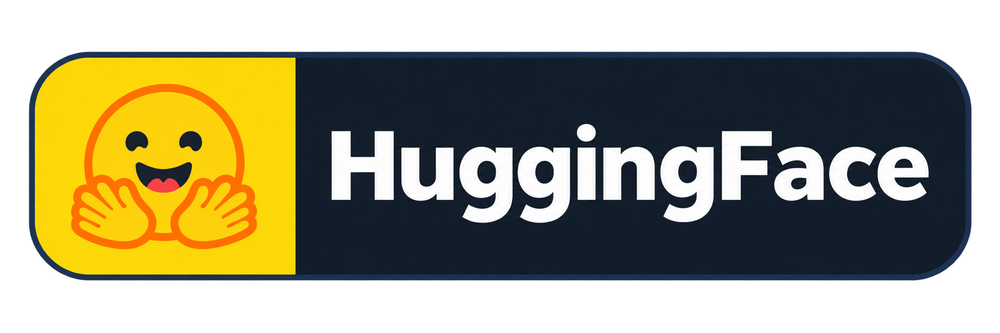
  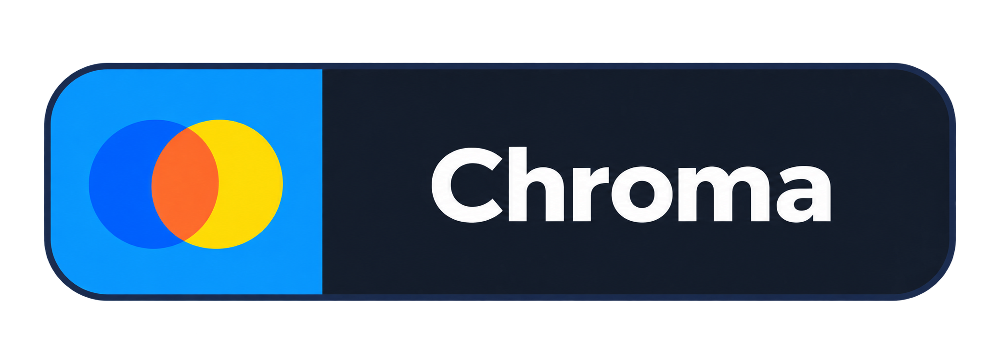
  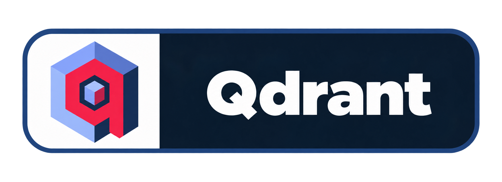
  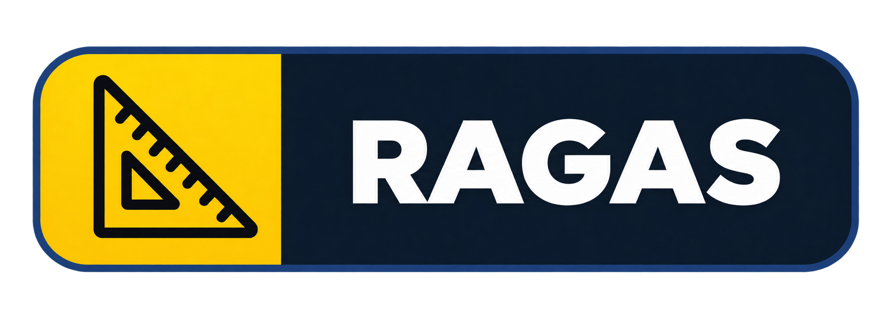

### ML & Data

  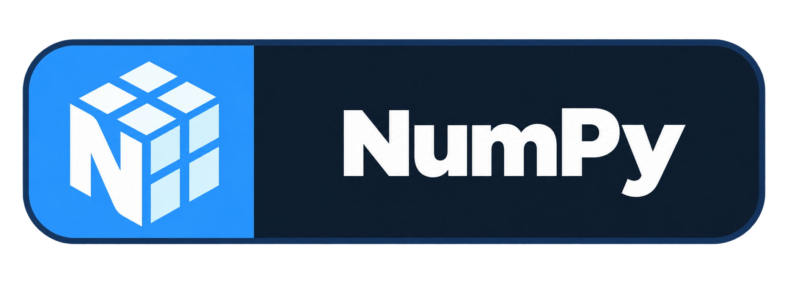
  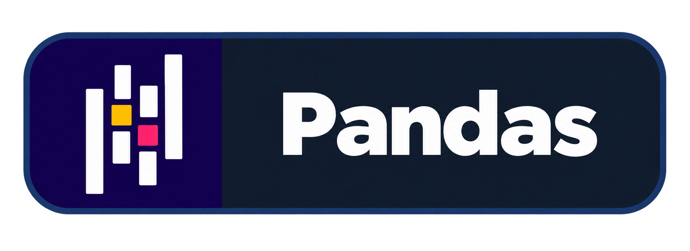
  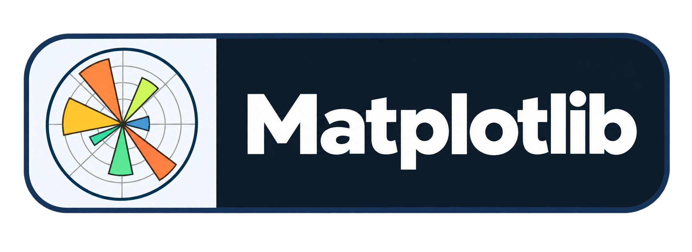
  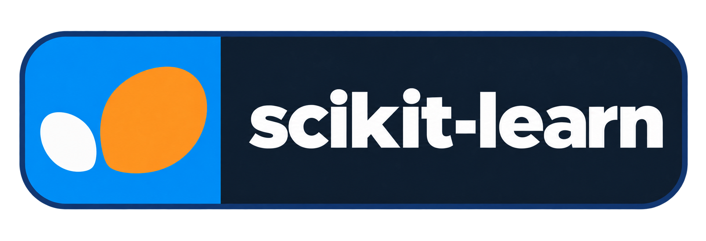
  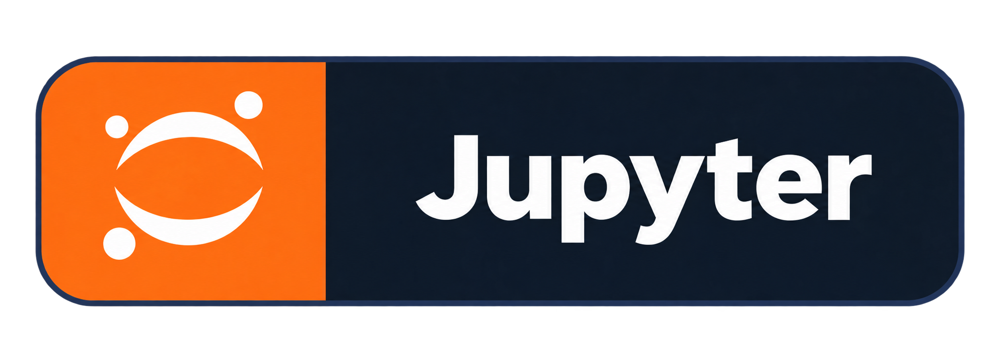

### Backend & Database

  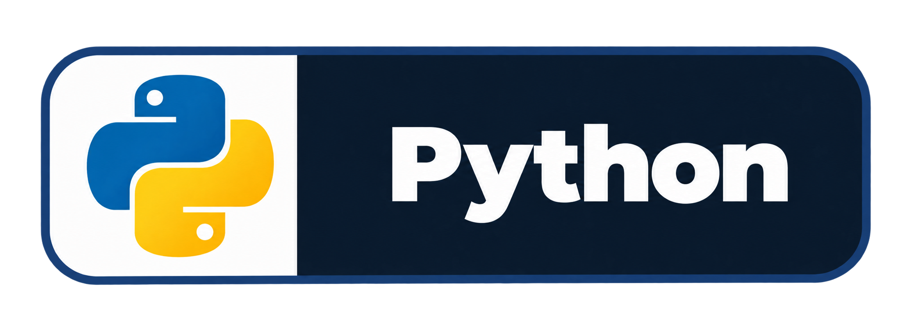
  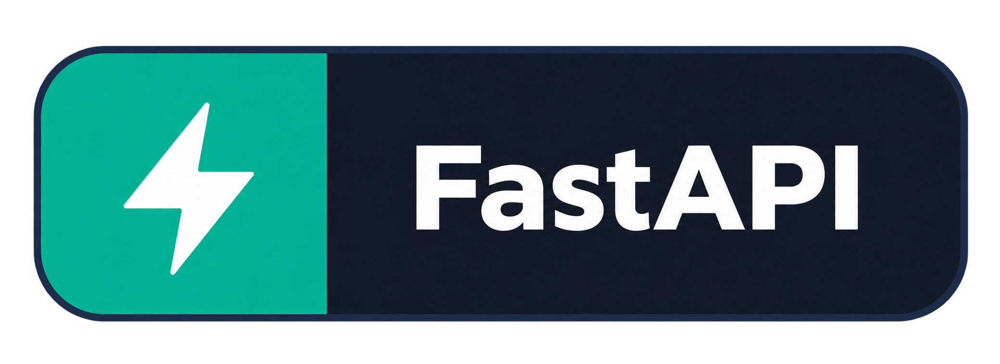
  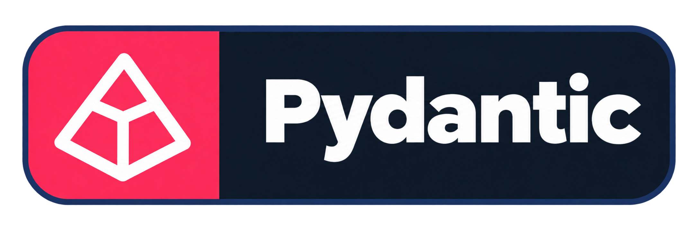
  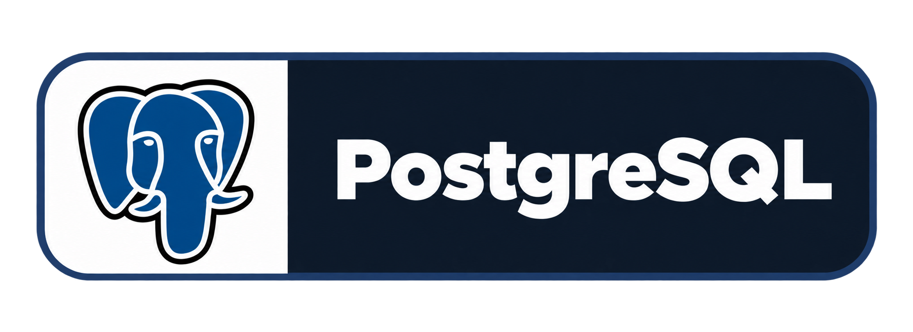
  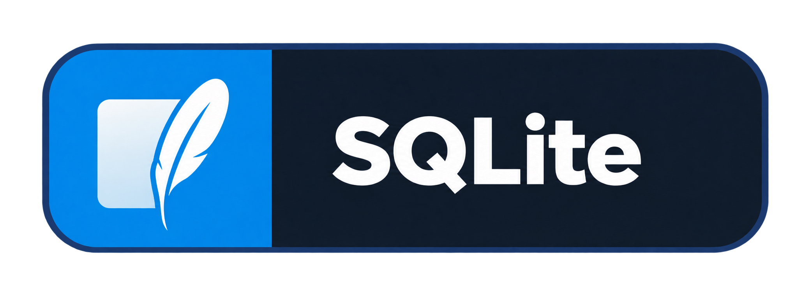
  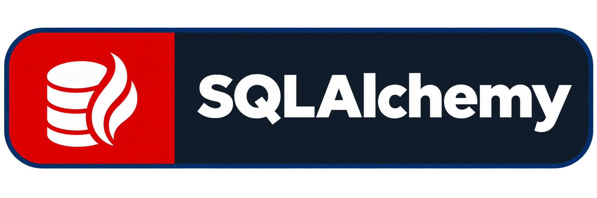
  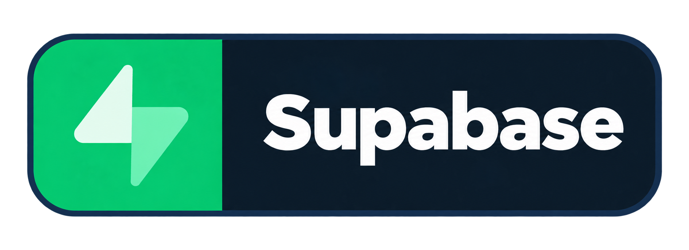

### DevOps & Tools

  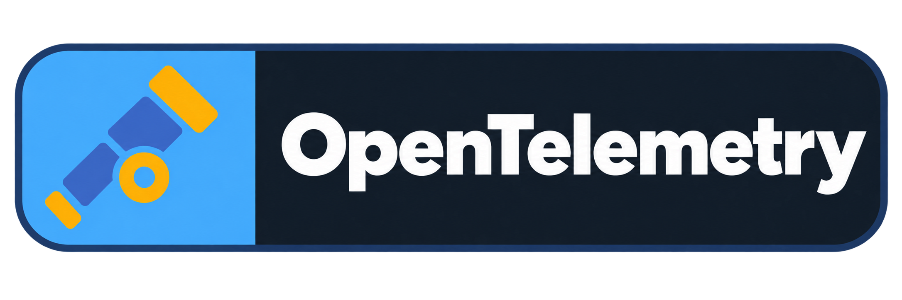
  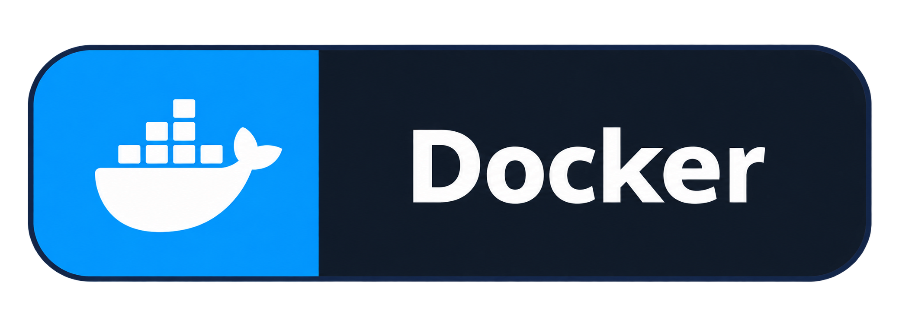
  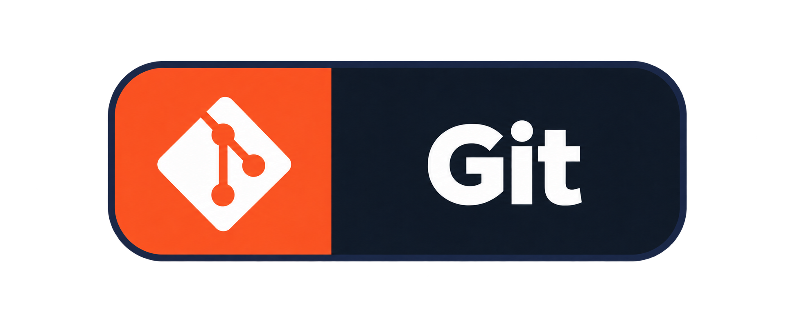
  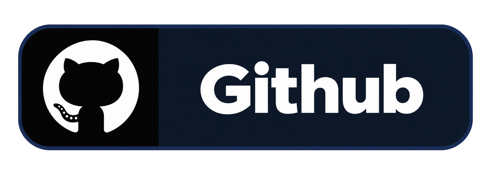
  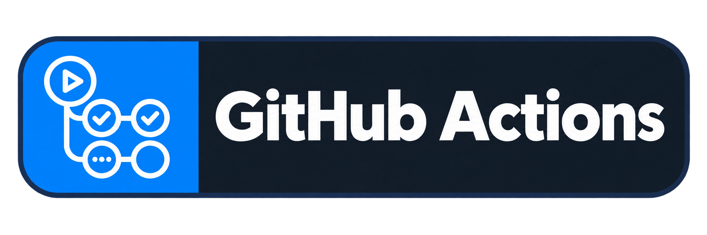
  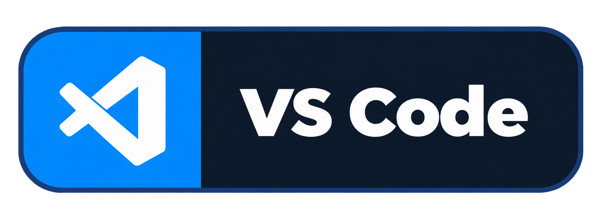
  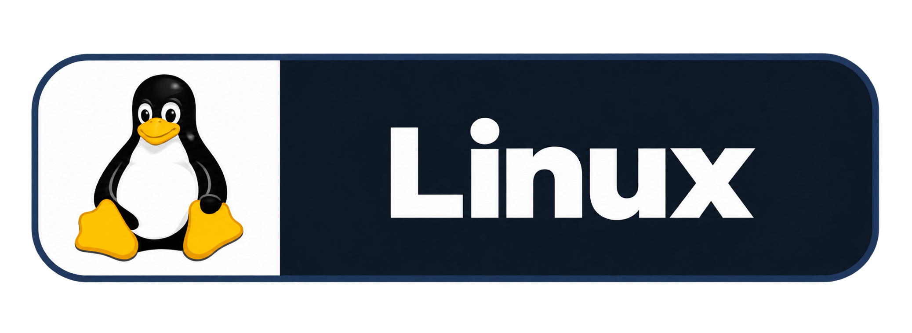
  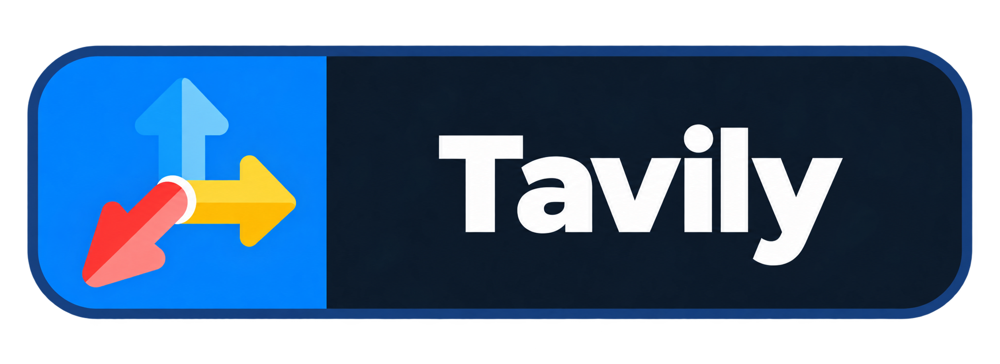
  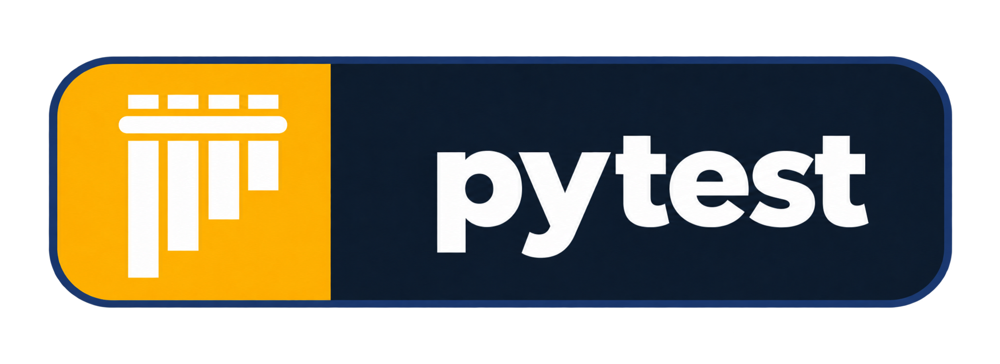
  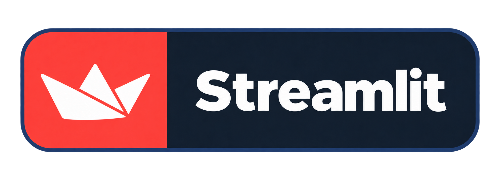

## Beyond the Code

Being a **Microsoft Student Ambassador** has given me the chance to be part of the student tech community, share what I learn, and help others explore AI and technology.

When I'm not building AI systems or debugging something that should've worked 20 minutes ago, you'll probably find me **gaming**, exploring new tech, or just chilling with good music.

## Contact Me

Wanna catch up? You can reach me at:

&nbsp;&nbsp;
&nbsp;&nbsp;
&nbsp;&nbsp;
&nbsp;&nbsp;

 

  <code>git status: still building...</code>

